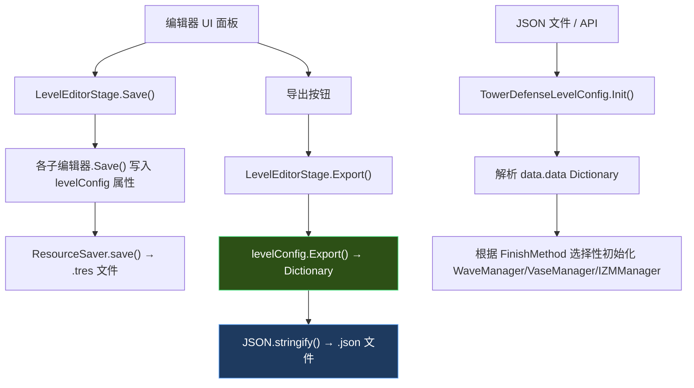

# 🔬 植物大战僵尸杂交版 — 关卡编辑器深度扫描报告

## 一、核心脚本路径清单

### 📂 主控制器

| 脚本 | 路径 | 职责 |
|------|------|------|
| **LevelEditorStage** | [LevelEditorStage.gd](file:///c:/Users/Houtas/Desktop/植物大战僵尸杂交版/Scene/LevelEditorStage/LevelEditorStage.gd) | 编辑器主场景控制器，管理5个编辑面板切换、保存/导出/测试 |

### 📂 五大编辑面板

| 脚本 | 路径 | 对应 UI 标签 |
|------|------|-------------|
| **LevelEditorInformationEditor** | [LevelEditorInformationEditor.gd](file:///c:/Users/Houtas/Desktop/植物大战僵尸杂交版/Prefab/GUI/LevelEditor/InformationEditor/LevelEditorInformationEditor.gd) | 📋 关卡信息（名称/描述/地图/BGM/暴风雨/雾等） |
| **LevelEditorEventEditor** | [LevelEditorEventEditor.gd](file:///c:/Users/Houtas/Desktop/植物大战僵尸杂交版/Prefab/GUI/LevelEditor/EventEditor/LevelEditorEventEditor.gd) | 🎬 事件编辑（初始化/就绪/开始事件） |
| **LevelEditorMapEditor** | [LevelEditorMapEditor.gd](file:///c:/Users/Houtas/Desktop/植物大战僵尸杂交版/Prefab/GUI/LevelEditor/MapEditor/LevelEditorMapEditor.gd) | 🗺️ 地图编辑（预放置植物/僵尸） |
| **LevelEditorSeedbankEditor** | [LevelEditorSeedbankEditor.gd](file:///c:/Users/Houtas/Desktop/植物大战僵尸杂交版/Prefab/GUI/LevelEditor/SeedbankEditor/LevelEditorSeedbankEditor.gd) | 🌱 种子栏编辑（选卡模式/传送带/种子雨） |
| **LevelEditorWaveEditor** | [LevelEditorWaveEditor.gd](file:///c:/Users/Houtas/Desktop/植物大战僵尸杂交版/Prefab/GUI/LevelEditor/WaveEditor/LevelEditorWaveEditor.gd) | 🌊 波次编辑（出怪配置/波事件） |

### 📂 核心数据模型

| 脚本 | 路径 | 职责 |
|------|------|------|
| **TowerDefenseLevelConfig** | [TowerDefenseLevelConfig.gd](file:///c:/Users/Houtas/Desktop/植物大战僵尸杂交版/Resource/TowerDefense/Level/TowerDefenseLevelConfig.gd) | ⭐ **核心中的核心** — 关卡数据定义 + `Init()` 反序列化 + `Export()` 序列化 |
| **TowerDefenseEnum** | [TowerDefenseEnum.gd](file:///c:/Users/Houtas/Desktop/植物大战僵尸杂交版/Resource/TowerDefense/TowerDefenseEnum.gd) | 所有游戏枚举定义 |
| **GeneralEnum** | [GeneralEnum.gd](file:///c:/Users/Houtas/Desktop/植物大战僵尸杂交版/Resource/General/GeneralEnum.gd) | 通用枚举(HOMEWORLD) |
| **TowerDefenseMapConfig** | [TowerDefenseMapConfig.gd](file:///c:/Users/Houtas/Desktop/植物大战僵尸杂交版/Resource/TowerDefense/Map/TowerDefenseMapConfig.gd) | 地图网格配置 |

---

## 二、保存 & 导出机制

### 💾 保存流程 (`Save()`)

```
LevelEditorStage.Save()
  ├── levelEditorEventEditor.Save()     →  写入 eventInit/eventReady/eventStart
  ├── levelEditorMapEditor.Save(true)   →  遍历网格收集 preSpawnList
  ├── levelEditorSeedbankEditor.Save()  →  写入 packetBankList/conveyorData/rainData
  ├── levelEditorWaveEditor.Save()      →  写入 waveManager
  └── ResourceSaver.save(levelConfig, "user://Diy/{uid}.tres")  ← 保存为 Godot .tres 资源
```

### 📤 导出 JSON 流程 (`Export()`)

```gdscript
// LevelEditorStage.gd 第227-248行
func Export() -> void:
    Save()
    DisplayServer.file_dialog_show("另存为项目", ..., ["*.json"], SaveFileTo)

func SaveFileTo(status, selected_paths, ...):
    var file = FileAccess.open(filePath, FileAccess.WRITE_READ)
    file.store_string(JSON.stringify(levelConfig.Export()))  // ← 这就是 JSON 导出入口
```

> [!IMPORTANT]
> Godot 中没有 `JSON.stringify`，代码使用的是 `JSON.stringify()`（Godot 4.x 的静态方法），底层调用 `levelConfig.Export()` 返回 Dictionary，再序列化为 JSON 字符串。

---

## 三、UI → 代码字段映射

### 🏷️ 信息面板 (InformationEditor)

| UI 元素 | 代码变量 | JSON 键 | 类型 | 说明 |
|---------|---------|---------|------|------|
| 关卡编号 | `levelNumberSpinBox` → `levelConfig.levelNumber` | `LevelNumber` | `int` | 关卡序号 |
| 关卡名称 | `levelNameLineEdit` → `levelConfig.levelName` | `LevelName` | `string` | 关卡显示名 |
| 关卡描述 | `levelDescriptionTextEdit` → `levelConfig.description` | `Description` | `string` | 关卡描述文字 |
| 主世界 | `homeWorldOptionButton` → `levelConfig.homeWorld` | `HomeWorld` | `enum string` | "NOONE" / "MORDEN" |
| 地图 | `mapOptionButton` → `levelConfig.map` | `Map` | `string` | 地图 key，如 "Frontlawn" |
| 背景音乐 | `bgmOptionButton` → `levelConfig.backgroundMusic` | `BGM` | `string` | BGM key |
| 游戏模式 | `finishMethodOptionButton` → `levelConfig.finishMethod` | `FinishMethod` | `enum string` | "WAVE" / "VASE" / "IZM" / "QUIZ" / "IZM2" |
| 对话 | `talkOptionButton` → `levelConfig.talk` | `Talk` | `string \| Dict` | 可以是预设名或自定义对话 |
| 教程 | `tutorialOptionButton` → `levelConfig.tutorial` | `Tutorial` | `string \| Dict` | 可以是预设名或自定义教程 |
| 暴风雨 ✅ | `stormOpenCheckBox` → `levelConfig.stormOpen` | `StormOpen` | `bool` | 暴风雨开关 |
| 割草机 ✅ | `mowerUseCheckBox` → `levelConfig.mowerUse` | `MowerUse` | `bool` | 割草机开关 |
| 雾效 ✅ | `fogUseCheckBox` → `levelConfig.fogManager.open` | `FogManager.Open` | `bool` | 雾效开关 |
| 雾起始列 | `fogBeginColumnSpinBox` → `levelConfig.fogManager.beginColumn` | `FogManager.BeginColumn` | `int` | 雾从第几列开始 |
| 罐子洗牌 ✅ | `vaseShuffleCheckBox` → `levelConfig.vaseManager.shuffle` | `VaseManager.Shuffle` | `bool` | 罐子模式洗牌 |
| 僵尸洗牌 ✅ | `_IZMShuffleCheckBox` → `levelConfig._IZMManager.shuffle` | `IZMManager.Shuffle` | `bool` | IZM模式洗牌 |

### 🌱 种子栏面板 (SeedbankEditor)

| UI 元素 | JSON 键 | 类型 | 说明 |
|---------|---------|------|------|
| 种植列模式 ✅ | `PacketBank.PlantColumn` | `bool` | 限制种植列 |
| 选卡方式 | `PacketBank.Method` | `enum string` | "NOONE"/"CHOOSE"/"PRESET"/"CONVEYOR"/"RAIN" |
| 冷却开启 ✅ | `PacketBank.ColdDownStart` | `bool` | 初始冷却 |
| 冷却使用 ✅ | `PacketBank.ColdDownUse` | `bool` | 是否启用冷却 |
| 初始阳光 | `SunManager.Begin` | `int` | 默认 300 |
| 阳光掉落 ✅ | `SunManager.Open` | `bool` | 是否掉阳光 |
| 阳光间隔 | `SunManager.SpawnInterval` | `float` | 掉阳光间隔秒 |
| 阳光数量 | `SunManager.SpawnNum` | `int` | 每次掉落阳光值 |
| 传送带间隔 | `PacketBank.ConveyorPreset.Interval` | `float` | |
| 传送带类型 | `PacketBank.ConveyorPreset.Type` | `string` | "Default"/"Sun" |
| 种子雨间隔 | `PacketBank.RainPreset.Interval` | `float` | |
| 种子雨存活时间 | `PacketBank.RainPreset.AliveTime` | `float` | |
| 种子雨类型 | `PacketBank.RainPreset.Type` | `string` | "Default"/"Sun" |

### 🌊 波次面板 (WaveEditor)

| UI 元素 | JSON 键 | 类型 | 说明 |
|---------|---------|------|------|
| 大波数 | 与 `FlagWaveInterval` 配合 | `int` | 总波数 = 大波数 × 旗帜波间隔 |
| 旗帜波间隔 | `WaveManager.FlagWaveInterval` | `int` | 每隔几波一面旗 |
| 僵尸隐身 ✅ | `WaveManager.ZombieInvisible` | `bool` | |
| 出怪起始列 | `WaveManager.BeginCol` | `float` | 默认 20.0 |
| 出怪列开始 | `WaveManager.SpawnColStart` | `float` | 默认 5.0 |
| 出怪列结束 | `WaveManager.SpawnColEnd` | `float` | 默认 20.0 |
| 最小下波血量% | `WaveManager.MinNextWaveHealthPercentage` | `float` | |
| 最大下波血量% | `WaveManager.MaxNextWaveHealthPercentage` | `float` | |

---

## 四、所有枚举值清单

### `LEVEL_FINISH_METHOD` (游戏模式/完成方式)

| 枚举值 | 含义 | 编辑器中文 |
|--------|------|-----------|
| `WAVE` | 波模式（标准塔防） | 波模式 |
| `VASE` | 罐子模式（砸罐子） | 罐子模式 |
| `IZM` | 我是僵尸模式 | 我是僵尸模式 |
| `QUIZ` | 测验/谜题模式 | (不在编辑器选项中) |
| `IZM2` | 我是僵尸模式 V2 | (不在编辑器选项中) |

### `LEVEL_SEEDBANK_METHOD` (种子栏/卡槽方式)

| 枚举值 | 值 | 含义 |
|--------|---|------|
| `NOONE` | 0 | 无（不显示卡槽） |
| `CHOOSE` | 1 | 选卡模式 |
| `PRESET` | 2 | 预选卡模式 |
| `CONVEYOR` | 3 | 传送带模式 |
| `RAIN` | 4 | 种子雨模式 |

### `HOMEWORLD` (主世界)

| 枚举值 | 值 | 含义 |
|--------|---|------|
| `NOONE` | 0 | 无 |
| `MORDEN` | 1 | 现代 |

### `LEVEL_REWARDTYPE` (奖励类型)

| 枚举值 | 含义 |
|--------|------|
| `NOONE` | 无 |
| `PACKET` | 植物卡包 |
| `COLLECTABLE` | 收藏品 |
| `COIN` | 金币 |
| `TROPHY` | 奖杯 |

---

## 五、地图与网格定义

地图配置定义在 [TowerDefenseMapConfig.gd](file:///c:/Users/Houtas/Desktop/植物大战僵尸杂交版/Resource/TowerDefense/Map/TowerDefenseMapConfig.gd) 中：

```gdscript
@export var gridNum: Vector2i = Vector2i(9, 5)      // 网格列数×行数，默认 9×5
@export var gridBeginPos: Vector2 = Vector2(256.0, 45.0)  // 网格起始像素位置
@export var gridSize: Vector2 = Vector2(80.0, 98.0)       // 每格像素大小
@export var mapSize: Vector2 = Vector2(1400, 600)          // 地图总像素尺寸
@export var edge: Vector4 = Vector4(200.0, 0.0, 1100.0, 576.0)  // 边界
@export var lineUse: Array[int]                              // 可用行列表
@export var isNight: bool = false                            // 是否夜晚
```

> [!IMPORTANT]
> **地图选择会改变网格参数！** `gridNum` 是每个地图 `.tres` 资源文件中各自配置的。
> - 前院 (Frontlawn): 典型 `9×5`
> - 泳池 (Pool): `9×6`（多了水域行）
> - 屋顶 (Roof): 可能有不同的列数和 `gridBeginPos` 偏移
>
> 编辑器代码 `MapOptionButtonItemSelected` 中：
> ```gdscript
> fogBeginColumnSpinBox.max_value = mapConfig.gridNum.x   // 雾起始列的最大值随地图变化
> LevelEditorWaveEditor.instance.MapChange(mapConfig)      // 波次编辑器行数也随之变化
> ```
> `MapChange()` 中：
> ```gdscript
> packetContainer.visible = i < _config.gridNum.y           // 隐藏超出行数的出怪行UI
> ```

---

## 六、完整 JSON Schema 模板

以下是从 `TowerDefenseLevelConfig.Export()` 及所有子 `Export()` 方法精确反推出的完整 JSON 结构：

```jsonc
{
  // ==================== 基础信息 ====================
  "LevelName": "string",           // 关卡名称
  "LevelNumber": 1,                // 关卡编号
  "Description": "string",         // 关卡描述

  // ==================== 世界/模式设置 ====================
  "HomeWorld": "NOONE",            // 枚举: "NOONE" | "MORDEN"
  "FinishMethod": "WAVE",          // 枚举: "WAVE" | "VASE" | "IZM" | "QUIZ" | "IZM2"

  // ==================== 对话/教程 ====================
  "Talk": "",                      // string(预设名) 或 Dictionary(自定义对话)
  "Tutorial": "",                  // string(预设名) 或 Dictionary(自定义教程)

  // ==================== 地图/音效/天气 ====================
  "Map": "Frontlawn",             // 地图 key ("Frontlawn", "Pool", "Roof" 等)
  "BGM": "Frontlawn",             // 背景音乐 key
  "MowerUse": true,                // 是否启用割草机
  "StormOpen": false,              // 是否启用暴风雨

  // ==================== 奖励 ====================
  "Reward": {
    "RewardType": "COIN",          // 枚举: "NOONE" | "PACKET" | "COLLECTABLE" | "COIN" | "TROPHY"
    "RewardFirst": 2000            // 首次通关奖励值
  },

  // ==================== 事件系统 ====================
  "Event": {
    "EventInit": [                 // 关卡初始化事件
      {
        "EventName": "string",     // 事件类名（如 "MapChange", "SunChange" 等）
        "Value": {}                // 事件参数（各事件不同）
      }
    ],
    "EventReady": [],              // 关卡就绪事件（同结构）
    "EventStart": []               // 关卡开始事件（同结构）
  },

  // ==================== 预放置实体 ====================
  "PreSpawn": {
    "Packet": [
      {
        "Name": "string",          // packet saveKey（如 "Peashooter", "ZombieNormal"）
        "GridPos": [1, 1],         // [列, 行]，1-indexed
        "CharacterOverride": {     // 可选 - 角色属性覆写
          // ...属性变更列表
        }
      }
    ]
  },

  // ==================== 种子栏/卡槽配置 ====================
  "PacketBank": {
    "LimitGridPlantNum": -1,       // 每格最大植物数，-1 = 不限
    "PlantColumn": false,          // 是否限制种植在特定列
    "ColdDownUse": true,           // 是否启用冷却
    "ColdDownStart": true,         // 开局是否初始冷却
    "Method": "CHOOSE",            // 枚举: "NOONE" | "CHOOSE" | "PRESET" | "CONVEYOR" | "RAIN"
    "Type": "GeneralPlant",        // packet bank 类型（"GeneralPlant" / "GeneralZombie"）
    "Value": [                     // 预设卡列表（CHOOSE/PRESET 模式使用）
      // 每项为 TowerDefenseLevelPacketConfig.Export() 结构
    ],

    // --- 当 Method = "CONVEYOR" 时额外出现 ---
    "ConveyorPreset": {
      "Type": "Default",           // "Default" | "Sun"
      "Interval": 3.0,             // 传送带出植物间隔(秒)
      "IntervalIncreaseEvery": 1000000,
      "IntervalMagnification": 0.5,
      "Packet": [                  // 传送带植物池
        // TowerDefenseConveyorPacketConfig.Export()
      ],
      "WaveEvent": []              // 按波次的传送带事件
    },

    // --- 当 Method = "RAIN" 时额外出现 ---
    "RainPreset": {
      "Type": "Default",           // "Default" | "Sun"
      "AliveTime": 30.0,           // 种子雨存活时间(秒)
      "Interval": 3.0,             // 种子雨间隔(秒)
      "Packet": [                  // 种子雨植物池
        // TowerDefenseRainModePacketConfig.Export()
      ]
    }
  },

  // ==================== 阳光管理器 ====================
  "SunManager": {
    "Open": true,                  // 是否掉阳光
    "Type": "Normal",              // 阳光类型
    "Begin": 300,                  // 初始阳光
    "SpawnInterval": 12.0,         // 掉阳光间隔(秒)
    "SpawnNum": 50,                // 每次掉落阳光值
    "MovingMethod": "LAND"         // 枚举: "LAND" | "GRAVITY" | "MOVING"
  },

  // ==================== 雾效管理器 ====================
  "FogManager": {
    "Open": false,                 // 是否启用雾效
    "BeginColumn": 5               // 雾从第几列开始
  },

  // ==================== 观星管理器 ====================
  "LookStarManager": {
    "Open": false,                 // 是否启用观星
    "Check": [                     // 观星检查列表
      {
        "PacketName": "string",    // 检查的植物名
        "GridPos": [0, 0]          // 检查位置 [列, 行]
      }
    ]
  },

  // ==================== 条件性管理器（根据 FinishMethod 三选一） ====================

  // --- 当 FinishMethod = "WAVE" 时 ---
  "WaveManager": {
    "ZombieInvisible": false,      // 僵尸是否隐身
    "FlagZombieUse": true,         // 是否使用旗帜僵尸
    "FlagZombie": "ZombieFlag",    // 旗帜僵尸 key
    "FlagWaveInterval": 10,        // 旗帜波间隔（每X波一面旗）
    "MaxNextWaveHealthPercentage": 0.15,  // 剩余血量%触发下一波(上限)
    "MinNextWaveHealthPercentage": 0.2,   // 剩余血量%触发下一波(下限)
    "BeginCol": 20.0,              // 出怪起始列位置
    "SpawnColEnd": 20.0,           // 出怪列结束
    "SpawnColStart": 5.0,          // 出怪列开始
    "SpawnOverride": {},           // 可选 - 全局出怪属性覆写
    "Dynamic": [                   // 动态出怪配置（最多7个阶段）
      {
        "PointIncrementPerWave": 0,// 每波增加的积分点
        "StartingPoints": 0,       // 起始积分点
        "StartingWave": 0,         // 起始波数
        "ZombiePool": []           // 僵尸池
      }
    ],
    "Wave": [                      // 波次列表
      {
        "DynamicPlantfood": [],    // 动态植物食品配置
        "Spawn": [                 // 固定出怪列表
          {
            "Zombie": "string",    // 僵尸 saveKey
            "Line": -1,            // 出怪行，-1 = 随机行
            "Num": 1,              // 数量
            "Override": {},        // 可选 - 僵尸属性覆写
            "SpawnEvent": [],      // 出生事件
            "DieEvent": []         // 死亡事件
          }
        ],
        "Dynamic": {               // 动态（积分制）出怪
          "Point": 0,              // 当波积分预算
          "ZombiePool": []         // 当波僵尸池
        },
        "Event": [                 // 当波事件
          {
            "EventName": "string",
            "Value": {}
          }
        ]
      }
    ],
    "Survival": ""                 // 生存模式配置（string 或 Dictionary）
  },

  // --- 当 FinishMethod = "VASE" 时 ---
  "VaseManager": {
    "Shuffle": true,               // 是否随机打乱罐子
    "Vase": [                      // 罐子列表
      {
        "PacketName": "string",    // 罐中内容 key
        "Type": "Normal",          // "Normal" | "Plant" | "Zombie"
        "GridPos": [1, 1],         // [列, 行]
        "Override": {}             // 可选 - packet 覆写
      }
    ],
    "VaseFill": [                  // 罐子填充规则
      {
        "PacketName": "string",
        "Override": {}             // 可选
      }
    ]
  },

  // --- 当 FinishMethod = "IZM" 时 ---
  "IZMManager": {
    "Shuffle": true                // 是否随机打乱
  }
}
```

---

## 七、关键数据流总结



> [!TIP]
> **关键发现：`Map` 字段和 `gridNum` 的关系**
> 
> JSON 中只存储地图 key（如 `"Frontlawn"`），而具体的网格列数(`gridNum.x`)、行数(`gridNum.y`)、格子大小等参数保存在引擎端的 `TowerDefenseMapConfig.tres` 资源中。
> 这意味着：**同一个 Map key 对应的网格参数是固定的，由引擎资源决定，而非 JSON 定义。**

> [!NOTE]
> **`FinishMethod` 驱动的条件分支**
> 
> 整个关卡配置最核心的分支逻辑是 `FinishMethod`：
> - `WAVE` / `IZM2` → 使用 `WaveManager`
> - `VASE` → 使用 `VaseManager` 
> - `IZM` → 使用 `IZMManager`
> 
> 三者互斥，JSON 中只会出现其中一个。
